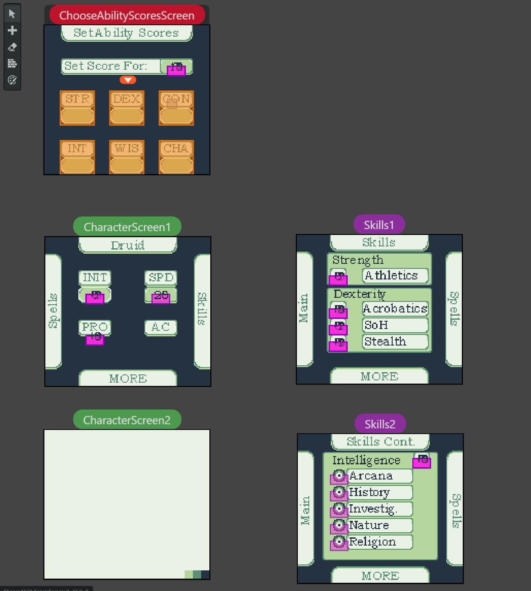

# GB_Character_Sheet
Character sheet maker for Dungeons &amp; Dragons created in GB Studio for the [Game Boy Competition 2021](https://itch.io/jam/gbcompo21). Because development is so early if you want to run the game you will have to download [GB Studio](https://www.gbstudio.dev/) and open the .gbsproj file with GB Studio.

Here is the terribly drawn (by me) title screen for the game. 

This screen shows the player choosing the ability scores for their character.

Here is a screenshot of what a small part of GB Studio development process looks like.

